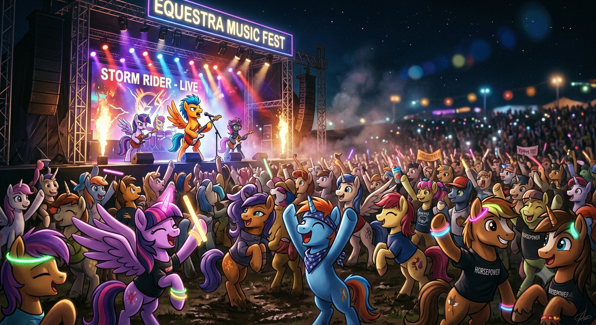

<div align="center">



# 🐴 Ponys Salvajes | Finder de Conciertos 🎸

**Galopa hacia la música: La plataforma que conecta tus gustos con el escenario**

<p>
  <a href="#qué-es-esto">Qué es esto</a> ·
  <a href="#equipo">Equipo</a> ·
  <a href="#features">Features</a> ·
  <a href="#stack">Stack</a> ·
  <a href="#cómo-correrlo">Cómo correrlo</a> ·
  <a href="#docs">Docs</a>
</p>

<br>

## ¿Qué es esto?

-- **Finder de Conciertos** es una app para buscar, descubrir y dar seguimiento
a conciertos y eventos musicales.

<br>

## Equipo 🐴

Equipo **Ponys Salvajes** — Ingeniería en Software

- García Villa Nelson Osmar | 322190357
- [Nombre Apellido]
- [Nombre Apellido]
- [Nombre Apellido]
- [Nombre Apellido]

<br>

## Features

Estado del sprint actual — se va marcando conforme se completan.

- [ ] Búsqueda de conciertos por artista, ciudad o fecha
- [ ] Perfil de usuario
- [ ] *(agregaremos aquí más features conforme se definan)*

<br>

## Stack

Aún no definido en equipo — se actualiza en cuanto se decida.

<div align="center">

| | |
|---|---|
| **Frontend** | `por definir` |
| **Backend** | `por definir` |
| **Base de datos** | `por definir` |

</div>

<br>

## Cómo correrlo

<details open>
<summary><b>Requisitos previos</b></summary>
<br>

- *(agregaremos lenguaje, versión, gestor de dependencias, smdb, etc.)*
- Git

</details>

```bash
# clonar 🐴
git clone https://github.com/SE-7003-2027/ponys_salvajes_finder_conciertos.git
cd ponys_salvajes_finder_conciertos

# instalar dependencias (por definir)

# levantar el proyecto (por definir)
```

<br>

## Docs 🐴

| | |
|---|---|
| Guía de estilo | [`docs/guia-de-estilo.md`](docs/guia-de-estilo.md) |
| Decisiones de arquitectura (ADRs) | [`docs/adr/`](docs/adr/) |
| Guía de contribución | [`CONTRIBUTING.md`](CONTRIBUTING.md) |

<br>

<p align="center"><sub>Hecho con 🐴 por el equipo Ponys Salvajes</sub></p>
